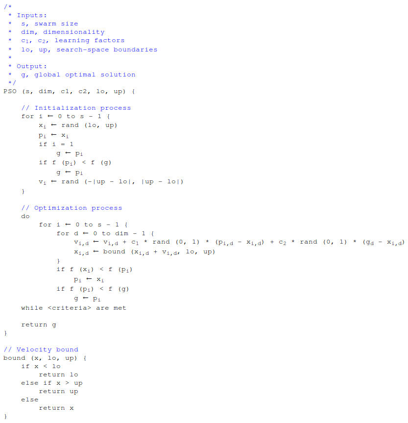

## Description

Particle Swarm Optimization (PSO) is an optimization technique developed by 
James Kennedy and Russell Eberhart [1] in 1995. 

The algorithm was inspired by *swarm intelligence* in nature, such as, bird 
flocking and fish schooling. Generally speaking, swarm intelligence(SI) systems
are composed of many individuals that coordinate their actions using 
*decentralized control*, meaning there is no need for a coordinator for the 
system to act. Furthermore, individuals are relatively *homogeneous* and 
although they follow simple behavioural rules and are not aware of the overall
behaviour of the system, their interactions lead to an "intelligent" global 
behaviour. In other words, complex collective behaviour can emerge from 
individuals following simple rules. 

PSO is initialized with a population of *particles*. Each particle moves through 
the *search-space* searching for the optimal solution. In every iteration, each 
particle has to move to a new position by adjusting its velocity according to 
its best known position and the best position known to the swarm.

## Pseudocode

## Flowchart

## Inertia Weight

An inertia weight parameter can be introduced into the velocity equation to
improve performance and to balance the global and local search [2]. The velocity 
equation then becomes:

Inertia weight can be constant or dynamic depending on the scheme being used. 
This program adjusts the inertia weight value at each iteration based on the 
following equation:

The PSO variation that implements the aforementioned idea is called **Linear 
Decreasing Inertia Weight PSO (LDIW-PSO)** [3].

## Stopping Criteria

The PSO iterates until it reaches a stopping criterion. The user can specify the 
stoping criterion of his/her choice. The available stopping criteria and their 
description are given below: 

1. **Maximum number of iterations**: The algorithm terminates when the number of 
iterations reaches a specified value.

2. **Stall generations**: The algorithm terminates when the number of stall 
generations reaches a specified value. In other words, when there is no 
immediate improvement after a specified number of iterations.

## Particle Initialization

The PSO performance is greatly affected by the starting positions of the 
particles. A common starting configuration is to randomly initialize each 
particle's position with a uniformly distributed random value. However, this 
configuration does not guarantee that the particles are evenly distributed 
throughout the search-space and is often the cause of variable performance. 

A more suitable starting configuration is based on centroidal Voronoi 
tessellations(CVT), and ensures that the particle's initial positions are more
evenly distributed throughout the search-space [4][5]. 

For more details regarding, the calculation of the generator points for the 
approximate centroidal Voronoi tesselation please visit the dedicated 
[repository](https://github.com/PictureElement/Approximate-CVT).

## Objective Functions

Five well-known benchmark problems are used to test the PSO. The test functions 
are *Ackley*, *Griewank*, *Rastrigin*, *Rosenbrock*, and *De Jong's Sphere*. You 
can select which function to use in *fitness.cpp*. 

## Usage

1. Select objective function to be minimized (*fitness.cpp*)

2. Provide parameters for PSO and CVT (*config.cpp*)

3. Compile

## References

[1]	J. Kennedy, R. C. Eberhart, “Particle Swarm Optimization,” Proceedings of 
the IEEE International Joint Conference on Neural Networks, IEEE Press, 1995, 
pp. 1942-1948.

[2]	Y. Shi and R.C. Eberhart. “A modified particle swarm optimizer.” In 
Proceedings of IEEE International Conference on Evolutionary Computation, 1998, 
pp. 69-73. 

[3]	M. A. Arasomwan and A. O. Adewumi. “On the Performance of Linear Decreasing 
Inertia Weight Particle Swarm Optimization for Global Optimization.” The 
Scientific World Journal, vol.2013(2):860289, Oct. 2013.

[4]	M. Richards and D. A. Ventura. “Choosing a Starting Configuration for the 
Particle Swarm Optimization.” Proceedings of the IEEE International Joint 
Conference on Neural Networks,  2004, pp.2309-2312.

[5]	L. Ju et al., “Probabilistic methods for centroidal Voronoi tessellations 
and their parallel implementations.” Parallel Comput., vol.28(10), 
pp. 1477-1500, Oct. 2002.